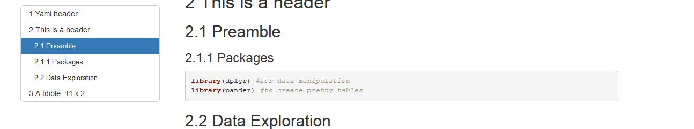
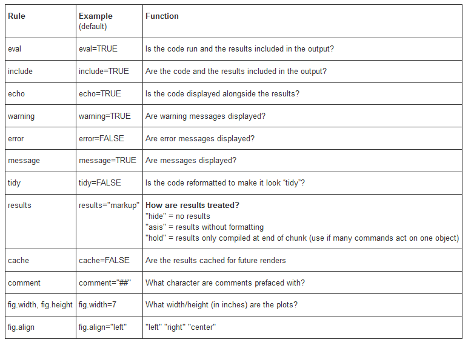

#Yaml header
 The first section of an rmarkdown is called the YAML header, and it offers various options mainly for the header & output formatting options. In the header above, we set a main title, an author, a creation date. We also set the output to html (by deafault), and we add a table of contents, specifying that it will be floating along our text. We also add automatic Only the Yaml output is show in final output.

An example of a floating toc is show below:




<!--- This is a markdown comment--->
<!--- Unlike R this , comments in Rmarkdown are defined by  a start
and an end and can span in multiple lines    
--->

#This is  level 1 header
  We can add multiple levels of headers as shown below. However we will see that by default rmarkdown TOC displayes levels up to 3.
  
##This is a level 2 header

###This is a level 3 header

###This is a level 4 header

#Text formatting

Our report text can be plaintext,  *or italics* or  **we can have a bold font** . We can also specify superscript or subscript:

* 2^10^ is 1024 

* H~2~O is the chemical formula for water

If one wishes, they can also add a footnote^[This will be a footnote] .
Finallyy, we can include mathematical text in our reports using *Latex* commands, for example:
$e^{i\pi} = -1$ or $\int_{a}^{b} x^2 dx$ .

#Lists

We can also use lists inside our reports. These lists can be either **unordered**, like the example seen in the super/subscript examples or **ordered** while sun-items can be added:

1. First item
2. Second item
  i) sub-item 1
  ii) sub-item 1   
3. Thrid item 


#Remote images and hyperlinks

  Hyperlinks are amazingly easy to add, simply type the URL. If we would like to include the Rmarkdown homepage, adding http://rmarkdown.rstudio.com/index.html would produce a functional link.
However, sometimes we like to include more *pretty* ways, to add a hyperlink.
For example: The homepage for Rmarkdown could be found [here](http://rmarkdown.rstudio.com/index.html).
We add images simply by adding an exclamation mark:


#Using R code

Using R in Rmarkdown is done in code blocks called chunks. A most basic example:
```{r}
a<-seq(1,100,1) #create a vector with a sequence from 1 to 100 with a step of 1
sum(a) #calculate the sum of the values inside vector a

```

By default the code is included in the final report.

##Load packages & chunck options
Sometimes we like to invoke a part of code without any messages or warnings shown. A typical example is loading packages to be used inside our analysis. Compare

```{r}
library(knitr)
library(pander)
```

```{r, message=FALSE, warning=FALSE}
library(knitr) #Both libraries are used
library(pander) #to create pretty tables
```

It should be noted that only data and packages directly called inside a rmarkdown file are usable.


##More Code chunk instructions

We can also show the output of a chunk without showing the code used to produce, for example in a case of a plot.

```{r, echo=FALSE}
A <- c("a", "a", "b", "b")
B <- c(5, 10, 15, 20)
df<- data.frame(A, B)
plot(df)
```

We can also define the size of a figure and an alignment for it:


```{r, echo=FALSE,fig.align='right',fig.height=4,fig.width=5}
plot(df)
```

An time-saving option seting *cache* option to TRUE. This instruction means that only chunks that have been altered will be run.

##More Chunck options


##Handling data frames

Default dataframe handling of Rmarkdown could be more pleasing.


```{r}
df
```

For more aesthetically pleasing graphs & more processing options we use package **knitr** or **pander**.


```{r}
knitr::kable(df)
```
```{r pander}
pander::pander(df)
```

Pander supports a large number of model outputs, so it is preffered in many cases.


#A very small analysis example

```{r import_packages, warning=FALSE,message=FALSE, error=FALSE}
library(ggplot2) #Contains iris dataset & will be used for plotting
library(dplyr) # allows various data manipulation actions, access to %>% operator
data("iris")
```

We will work with the famous Iris dataset. In the same chunk we will check the first 10 rows of our dataset and produce a summary of basic descriptive statistics.

```{r summary}
kable(head(iris))
kable(summary(iris))
pander(summary(iris))
```

We can use the group_by() function in dplyr to summarise by group.


```{r small_dplyr_example}

iris %>%  group_by(Species) %>%  summarise(count = n(), mean_SL = mean(Sepal.Length), sd_SL = sd(Sepal.Length)) %>% kable(.)
```

Plotting our data can generate insight.

```{r ggplot_examples}
ggplot(iris,aes(x=Species,y=Sepal.Width,colour=Species))+geom_boxplot()
ggplot(iris,aes(x=Sepal.Width,y=Sepal.Length,colour=Species))+geom_point()
ggplot(iris, aes(x=Sepal.Length, y=Sepal.Width, color=Species)) + geom_point() + stat_smooth(method="lm")
ggplot(iris, aes(Sepal.Length,fill=Species)) + geom_histogram(bins = 10) + facet_grid(Species ~ .)+scale_color_manual(values=c("red","blue","green"))

```


